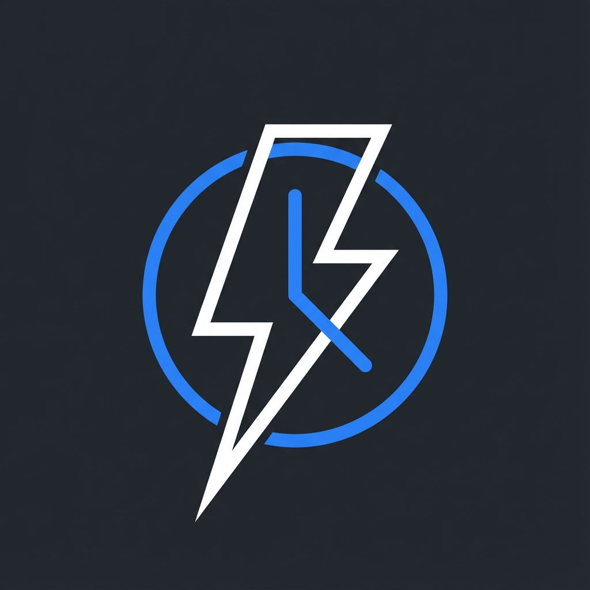
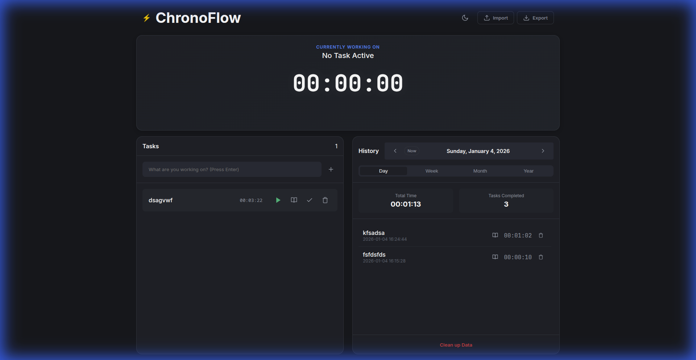

  
  <h1>ChronoFlow | Premium Time Tracker</h1>

A modern, offline-first time tracking application designed for focus and productivity. Built with vanilla HTML, CSS, and JavaScript for maximum performance and privacy.

## Features

-   **🧘 Zen Mode**: A distraction-free "Cinema Mode" that hides everything except your active task.
-   **⚡ Real-time Tracking**: Start, pause, and stop tasks with millisecond precision.
-   **📓 Integrated Journaling**: Add notes and context to every task. Supports clean formatting and one-click copying.
-   **📅 Comprehensive History**: View your productivity by Day, Week, Month, or Year. with visual charts.
-   **🌗 Dark & Light Themes**: A stunning UI that adapts to your environment.
-   **🔊 Auditory Feedback**: Distinct sounds for actions, warnings, and errors. Includes a satisfying "tactile" click for UI interactions.
-   **🎚️ Master Volume**: Adjustable global volume controls with persistent settings.
-   **🔒 Privacy First**: All data is stored locally in your browser. Offline-capable with local font hosting.
-   **🧹 Cleanup Tools**: Manage your data with granular deletion options.

## How to Use

1.  **Start a Task**: Type a task name in the input field and press `Enter` or click "Add".
2.  **Track Time**: Click the **Play** (▶) button on a task to start the global timer.
3.  **Journal**: Click the **Journal** icon to add notes or copy task details to your clipboard.
4.  **Complete**: Click the **Stop** (square/check) button to archive the task to History.
5.  **Review**: Switch tabs in the History panel to see your progress over time.
6.  **Zen Mode**: Click the **Eye** icon in the header to focus.
7.  **Settings**: Click the **Gear** icon to adjust Master Volume.
8.  **Shortcuts**: Press `Shift + ?` to view keyboard shortcuts.

> **Fun Fact**: Try clicking the **ChronoFlow** logo in the top-left corner! 🦔

## Installation

Simply open `index.html` in any modern web browser. No server or installation required.

## License

This project is licensed under the MIT License - see the [LICENSE](LICENSE) file for details.

---

**Copyright © 2026 ryumada**

**Developed with [Google Antigravity](https://antigravity.google/)**
