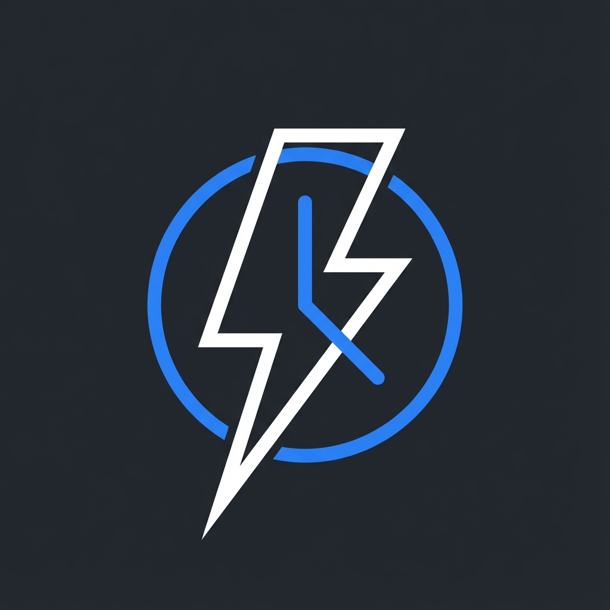
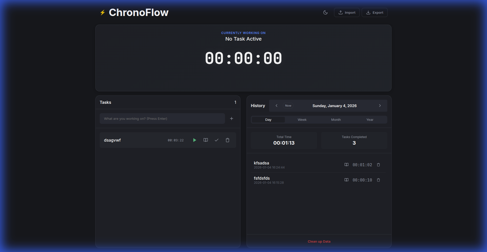

<div align="center">
  
  <h1>ChronoFlow | Premium Time Tracker</h1>
</div>

A modern, offline-first time tracking application designed for focus and productivity. Built with vanilla HTML, CSS, and JavaScript for maximum performance and privacy.

You can open the app by visiting this URL: [https://ryumada.github.io/chronoflow/](https://ryumada.github.io/chronoflow/).



## Features

-   **🧘 Zen Mode**: A distraction-free "Cinema Mode" that hides everything except your active task.
-   **⚡ Real-time Tracking**: Start, pause, and stop tasks with millisecond precision.
-   **📓 Integrated Journaling**: Add notes and context to every task. Supports clean formatting and one-click copying.
-   **📅 Comprehensive History**: View your productivity by Day, Week, Month, or Year. with visual charts.
-   **🌗 Dark & Light Themes**: A stunning UI that adapts to your environment.
-   **🔊 Auditory Feedback**: Distinct sounds for actions, warnings, and errors. Includes a satisfying "tactile" click for UI interactions.
-   **☁️ Google Drive Cloud Sync**: Back up and restore tasks and history directly to your private Google Drive (AppData folder). 100% private with no external servers.
-   **🎚️ Master Volume**: Adjustable global volume controls with persistent settings.
-   **🔒 Privacy First**: All data is stored locally in your browser. Offline-capable with local font hosting.
-   **🧹 Cleanup Tools**: Manage your data with granular deletion options.

## How to Use

1.  **Start a Task**: Type a task name in the input field and press `Enter` or click "Add".
2.  **Track Time**: Click the **Play** (▶) button on a task to start the global timer.
3.  **Journal**: Click the **Journal** icon to add notes or copy task details to your clipboard.
4.  **Complete**: Click the **Stop** (square/check) button to archive the task to History.
5.  **Review**: Switch tabs in the History panel to see your progress over time.
6.  **Zen Mode**: Click the **Eye** icon in the header to focus.
7.  **Cloud Sync**: Open **Settings** (⚙️) to connect your Google account and back up or restore data anytime.
8.  **Shortcuts**: Press `Shift + ?` to view keyboard shortcuts.

> **Fun Fact**: Try clicking the **ChronoFlow** logo in the top-left corner! 🦔

## Installation & Running Locally

Because ChronoFlow uses modern ES6 modules, it must be served over `http://` or `https://` (opening the `index.html` file directly as `file://` will cause CORS errors).

You can use the provided startup scripts to easily launch a local development server:

**Using Python:**
```bash
./scripts/start_http_server-python3.sh # Or python3 -m http.server 8098 from the root directory
```

**Using Node.js:**
```bash
./scripts/start_http_server-npm.sh # Or npx http-server -p 8098 from the root directory
```

Then, open your browser and navigate to `http://localhost:8098`.

*Note: ChronoFlow can be deployed natively to GitHub Pages or any standard static hosting provider with no build steps.*

## Google Drive Cloud Sync Setup

ChronoFlow uses **Google Identity Services (GIS)** to securely store backups in the user's private Google Drive `appDataFolder`. To configure your own Google OAuth 2.0 Client ID:

### 1. Create a Project in Google Cloud Console
1. Go to the [Google Cloud Console](https://console.cloud.google.com/).
2. Create a new project (e.g. `ChronoFlow Time Tracker`) or select an existing one.

### 2. Enable the Google Drive API
1. Navigate to **APIs & Services > Library**.
2. Search for **Google Drive API** and click **Enable**.

### 3. Configure OAuth Consent Screen
1. Navigate to **APIs & Services > OAuth consent screen**.
2. Select user type **External** and click **Create**.
3. Fill in basic app information:
   - **App name**: `ChronoFlow`
   - **User support email**: Your email address
   - **Developer contact information**: Your email address
4. Under **Scopes**, click **Add or Remove Scopes** and add:
   - `https://www.googleapis.com/auth/drive.appdata` (*View and manage its own configuration data in your Google Drive*)
   - `https://www.googleapis.com/auth/userinfo.profile` (*See your personal info*)
   - `https://www.googleapis.com/auth/userinfo.email` (*See your primary Google Account email address*)
5. Under **Test users**, add your Google email address (required while in testing status).

### 4. Create OAuth 2.0 Web Client ID
1. Navigate to **APIs & Services > Credentials**.
2. Click **+ Create Credentials > OAuth client ID**.
3. Set **Application type** to **Web application**.
4. Set **Name** to `ChronoFlow Web Client`.
5. Under **Authorized JavaScript origins**, add your local origin(s) and any production URL:
   - `http://localhost:8098`
   - `http://127.0.0.1:8098`
   - `https://ryumada.github.io` *(if deploying to GitHub Pages)*
6. Click **Create** and copy your generated **Client ID**.

### 5. Configure in ChronoFlow
1. Open ChronoFlow in your browser.
2. Click the ⚙️ **Settings** button in the header.
3. Under **Google Cloud Sync**, expand **Custom OAuth Client ID (Advanced)**.
4. Paste your Client ID and click **Save**.
5. Click **Sign in with Google** to connect your account. You can now use **Backup (Upload)** and **Restore (Download)** at any time!
## License

This project is licensed under the MIT License - see the [LICENSE](LICENSE) file for details.

---

**Copyright © 2026 ryumada**

**Developed with [Google Antigravity](https://antigravity.google/)**
